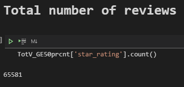
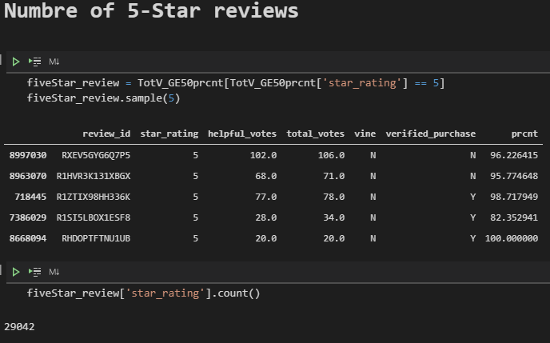
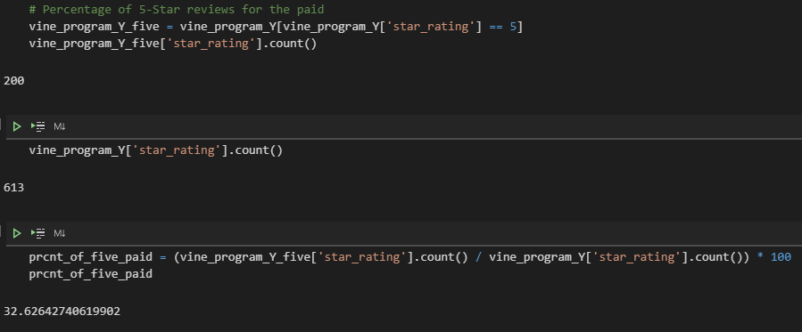
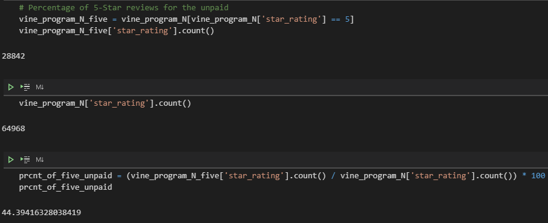

# Amazon Vine Analysis

# Overview
Analyze Amazon reviews written by members of the paid Amazon Vine program. Perform the ETL process to extract the dataset, transform the data, connect to an AWS RDS instance, and load the transformed data into pgAdmin. Determine if there is any bias toward favorable reviews from Vine members in your dataset.

# Results
- How many Vine reviews and non-Vine reviews were there?

There were 613 reviews as part of the Vine program (paid)

There were 64,968 reviews that were not part of the Vine program (unpaid)

- How many Vine reviews were 5 stars? How many non-Vine reviews were 5 stars?

There were 200 5-Stars as Vine reviews

There were 28,842 5-Stars as Vine reviews

- What percentage of Vine reviews were 5 stars? What percentage of non-Vine reviews were 5 stars?

Percentage of 5-Stars Vine reviews is 32.6%

Percentage of 5-Stars non-Vine reviews is 44.4%

# Summary
It is not a possible bias for the reviews program. The analysis shows that the percentage for unpaid reviews is 44% and for paid reviews is 33% of the five-star reviews. That demonstrates that no matter if a product is paid or not, the reason behind the review is going to be accurate and is not influenced by the paid program. I would expect that the result of five-star reviews was going to be much higher, more than 60%, if we keep in mind that the people are being compromised for the fact in reviewing the item in change for the review. On the contrary, the percentage is relatively low.
